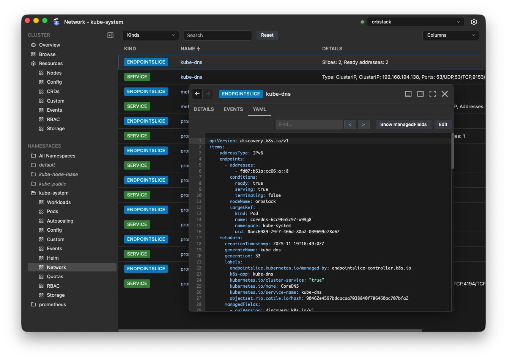

# Luxury Yacht

Luxury Yacht is a desktop app for managing Kubernetes clusters, available for Linux, macOS, and Windows.



New to Luxury Yacht? Read the [primer](docs/primer.md)!

## Installation

Go to the [Releases](https://github.com/luxury-yacht/app/releases) page to download the latest version.

Packages are available for `amd64 (x86_64)` and `arm64 (aarch64)`. Be sure to download the correct package for your architecture.

### macOS

Uses a standard DMG. Open the DMG and drag to `Applications`.

Can also be installed via [Homebrew](https://brew.sh).

```sh
brew install luxury-yacht
```

### Linux

Install via `.deb` or `.rpm` package.

### Windows

Uses a standard installer. Note that these are unsigned, so will require extra confirmation steps to run. Given the cost of a code-signing certificate, these will likely remain unsigned.

### Building from Source

If you prefer to build the app from source, see the Development section.

### Troubleshooting

#### The app won't start on Linux

Luxury Yacht requires webkit2 4.1. Some distros don't include it, or don't install it by default. Installation will vary depending on your distro.

| Distro       | Installation                           |
| ------------ | -------------------------------------- |
| Ubuntu 20.04 | Unsupported                            |
| Ubuntu 22.04 | `sudo apt install libwebkit2gtk-4.1-0` |

If your distro isn't on this (admittedly short) list, you'll have to search your package manager to determine the exact package name. If you have info you'd like to add to this list, email [admin@luxury-yacht.app](mailto:admin@luxury-yacht.app) or open an issue.

## Development

### Prerequisites

- Go 1.25
- Node 25
- [Wails](https://wails.io/)
- [Mage](https://magefile.org/)
- [Staticcheck](https://staticcheck.dev/)

#### Wails

Luxury Yacht is built with [Wails](https://wails.io/), a framework for building cross-platform apps in Go.

To install Wails:

```bash
 go install github.com/wailsapp/wails/v2/cmd/wails@2.11.0
```

Once Wails is installed, run `wails doctor` to see what other dependencies are required for your OS.

#### Staticcheck

Staticcheck is a static analysis linter for Go.

To install Staticcheck:

```bash
go install honnef.co/go/tools/cmd/staticcheck@latest
```

#### Mage

For scripting builds, testing, releases, etc., Luxury Yacht uses [Mage](https://magefile.org/) for cross-platform compatibilty. Makefiles and bash scripts are fine for Linux and macOS, but they don't work in Windows. The `magefile` is written in Go, so should work the same in any OS.

To install Mage:

```bash
go install github.com/magefile/mage@latest
```

To see what `mage` targets are available, run `mage -l` in the repo root.

### Development Mode

The fastest way to get the app up and running for development is to run in Wails development mode. This gives you hot-reloads and access to the browser console for debugging.

```bash
mage dev
```

Note that hot-reload of the Go backend will cause the app to restart, while changes to frontend code will be reflected immediately without an app restart.

### Build

```bash
mage build
```

### Install

To install the app locally:

```bash
mage install:unsigned
```

## Versions

When updating versions in the app, these are the canonical sources. All scripts/workflows should get app and toolset versions from these sources and these sources only.

#### App Version

App version is derived from `info.productVersion` in [wails.json](wails.json)

```bash
APP_VERSION=$(jq -r '.info.productVersion' wails.json)
```

#### Go Version

Go version is derived from go.mod

```bash
GO_VERSION=$(grep '^go ' go.mod | awk '{print $2}')
```

#### Wails Version

Wails version is derived from go.mod

```bash
WAILS_VERSION=$(grep 'github.com/wailsapp/wails/v2' go.mod | awk '{print $2}')
```

#### Node Version

Node version is derived from .nvmrc

```bash
NODE_VERSION=$(cat .nvmrc | tr -d 'v')
```

## Publishing Releases

Run the prerelease checks. This should surface any problems that could cause the release to fail.

```bash
mage qc:prerelease
```

1. Update the version in [wails.json](wails.json)

1. Commit and push the change.

1. Create and push a tag. The `release` workflow will do the rest.

```bash
git tag $(jq -r '.info.productVersion' wails.json)
git push origin main --tags
```
