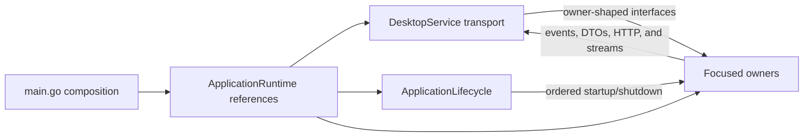

# Backend Service Architecture

The backend is composed from focused state owners and coordinators. This page is
the canonical map of those owners and the permitted dependency directions. The
domain documents linked below remain authoritative for each owner's detailed
behavior.

## Composition and transport

`main.go` creates the Wails application, passes that concrete application to
`backend.NewApplicationRuntime`, constructs `DesktopService` from the returned
owners, and registers only that service with Wails. `ApplicationRuntime` is a
reference-only composition result: it owns no behavior or mutable state, and no
owner may retain a pointer to it.

`NewApplicationRuntime` creates each stateful owner through a dependency
constructor. The composition root must not create an empty owner and fill its
private fields afterward. Cycles are broken with explicit one-way seams: Cluster
Runtime starts with an unavailable discovery repository that Preferences replaces
before startup work can run, and the refresh settings bridge retains values until
Refresh is bound. Those are construction-time links, not general owner back-pointers.

`DesktopService` owns the Wails command names, generated-binding reachability,
the `/api/v2` transport entry point, and lifecycle delegation. It does not own
application behavior. Its twelve command interfaces each correspond to one
focused owner; HTTP and lifecycle are separate collaborators. Backend owners are
not independently Wails-bound and do not need `//wails:ignore` directives.

The last arrow represents outputs crossing the transport boundary, not a
permission for an owner to call `DesktopService`.

## Owner map

| Owner | Responsibility |
| --- | --- |
| `ApplicationLifecycle` | Wails service startup/shutdown, runtime readiness, process context, and ordered owner lifecycle |
| `DesktopShell` | Concrete Wails application/window/menu/dialog/clipboard access and process-wide ephemeral UI visibility |
| `DesktopService` | Wails transport signatures and delegation only |
| `FavoritesService` | Favorites persistence and ordering |
| `UIStateStore` | Persisted grid and cluster-tab UI state |
| `PreferencesService` | Settings persistence, themes, zoom, search paths, and coalesced lazy loading |
| `SettingsEffectDispatcher` | Stateless, post-commit routing from Preferences to write-only runtime sinks |
| `ErrorReportingService` | Reporter configuration and installation-registration state |
| `AppLogService` | Process log buffer and frontend log commands |
| `UpdateCoordinator` | Update checks, download, staging, reconciliation, skip state, and restart |
| `ClusterAttentionService` | Attention rules, persistence transactions, live targets, and its lock |
| `ClusterWorkspaceProjection` | Replayable health, namespace-scope revisions, and aggregate workspace revision |
| `ClusterRuntimeManager` | Kubeconfig discovery, cluster clients, auth/recovery, transport health, API metrics, and client rate limits |
| `RefreshCoordinator` | Per-cluster refresh/catalog lifecycles, HTTP/streams, publication, governor/spill state, and global log limiter |
| `WorkspaceCoordinator` | Peer selections, serialized selection mutations, namespace-scope rebuilds, foreground demand, and workspace assembly |
| `ResourceGateway` | Request-shaped resource reads/actions, permission and response caches, YAML, details, and logs |
| `OperationsCoordinator` | Shell, port-forward, drain, active-operation registry, and cleanup |
| `DataManagementCoordinator` | Import/export and owner-directed live factory reset |
| `ContainerLogsSelectionPolicy` | Shared per-scope container-log selection limit |
| `PermissionFetchPolicy` | Shared SSRR fetch-concurrency limit |

The frontend command allocation is maintained in the command-to-owner table in
[data-access.md](data-access.md#wails-command-boundary). Internal-only owners
still appear here because they own state or cross-owner sequencing even though
they expose no Wails command.

## Dependency direction

Dependencies point toward capabilities, never back toward the composition root:

- `DesktopService` delegates to the twelve command owners, `ApplicationLifecycle`,
  and the refresh HTTP handler. No owner calls back into `DesktopService`.
- `ApplicationLifecycle` orders owners during startup and shutdown but does not
  absorb their state.
- `WorkspaceCoordinator` sequences `ClusterRuntimeManager` and
  `RefreshCoordinator`. Cluster Runtime publishes typed intents to an owner-local
  queue; Workspace is their single consumer, so Cluster Runtime does not call
  back into Workspace.
- `RefreshCoordinator` reads Cluster Runtime, registers Attention targets, and
  invokes `ResourceGateway` cache invalidators. Resource requests never call
  Refresh or acquire refresh/subsystem locks.
- Refresh publishes catalog and retry-telemetry state into leaf projections.
  `ResourceGateway` and `OperationsCoordinator` read those projections instead
  of depending back on `RefreshCoordinator`.
- `OperationsCoordinator` uses narrow cluster, permission, event, logging, and
  projection collaborators. It owns all operation cleanup.
- `DataManagementCoordinator` may sequence owner reset methods and narrow
  Workspace/Refresh functions. It does not become the owner of the state it
  resets.
- `DesktopShell` retains the concrete Wails application. Do not introduce a
  generic desktop adapter or move native state into persisted `UIStateStore`.

Cross-owner callbacks must be narrow and direction-specific. A shared leaf
projection may be read by multiple owners, but it must have one writer and may
not call those readers.

## Settings effects

`PreferencesService` persists and publishes an immutable settings snapshot only
after releasing its lock. `SettingsEffectDispatcher` then pushes six effects to
their owners:

| Effect | Target owner |
| --- | --- |
| Error-reporting enablement | `ErrorReportingService` |
| Kubernetes client QPS/burst | `ClusterRuntimeManager` |
| SSRR fetch concurrency | `PermissionFetchPolicy` |
| Per-scope container-log limit | `ContainerLogsSelectionPolicy` |
| Global container-log limit | `RefreshCoordinator` |
| Metrics refresh interval | `RefreshCoordinator` |

These sinks are write-only: they must not read Preferences, call another effect
owner, or acquire a settings or refresh lock while holding a leaf-policy lock.

## Placing new behavior

1. Put a frontend-callable signature on `DesktopService`, but put its behavior
   and state on exactly one owner.
2. Put a lock, cache, persisted document, or lifecycle resource on the owner of
   the invariant it protects.
3. Put a workflow spanning owners on a coordinator; pass narrow capabilities,
   not `ApplicationRuntime` or an all-backend interface.
4. Prefer one-way events, invalidators, or leaf projections when a direct call
   would create a dependency cycle.
5. Route runtime preference changes through a write-only settings-effect sink.
6. Keep cluster data keyed by `clusterId` and boundary-crossing objects identified
   by their complete resource reference.

## Detailed contracts

- Process composition and lifecycle: [application-lifecycle.md](application-lifecycle.md)
- Command allocation, resources, bindings, and settings: [data-access.md](data-access.md)
- Cluster/workspace direction: [multi-cluster.md](multi-cluster.md)
- Refresh ownership and projections: [refresh-system.md](refresh-system.md)
- Namespace-scope sequencing: [namespace-scope.md](namespace-scope.md)
- Operation ownership and cleanup: [operation-lifecycle.md](../workflows/operation-lifecycle.md)
- Permission and cache rules: [permissions.md](permissions.md)
