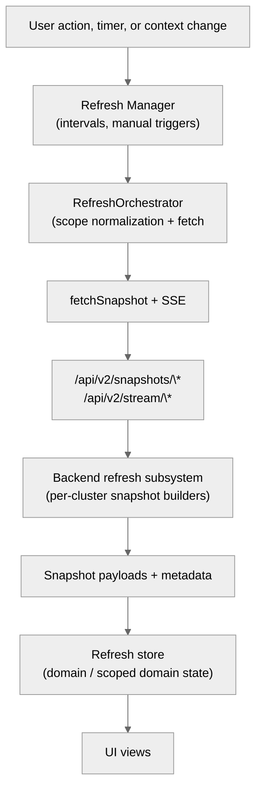

# Refresh system and multi-cluster support

This document explains how Luxury Yacht refreshes data, how refresh state flows through the frontend and backend, and how multi-cluster scoping is enforced. The goal is to make the mechanics easy to follow even if you are new to the codebase.

## Overview

The refresh system has three layers:

- Backend refresh subsystem(s) build snapshots and stream updates per cluster.
- A lightweight HTTP API serves snapshots, manual refresh jobs, and telemetry.
- The frontend refresh orchestrator schedules refreshes, scopes requests to the active cluster(s), and caches results in the refresh store.

Multi-cluster support uses a single refresh orchestrator in the frontend and a backend subsystem per active cluster. All snapshot payloads include cluster metadata, and frontend scopes encode cluster IDs so the right data shows in the right tab.

## Definitions

Explanations of terminology used in this document.

| Term                 | Area     | Definition                                                                                                                                                                                                                         |
| -------------------- | -------- | ---------------------------------------------------------------------------------------------------------------------------------------------------------------------------------------------------------------------------------- |
| Backend Subsystem    | Backend  | Backend refresh services that run for a cluster. Each active cluster has its own subsystem which registers domains, builds/serves snapshots, streams HTTP routes, runs manual refresh jobs, and records telemetry for its cluster. |
| Manual Refresh Job   | Backend  | A background task created when the frontend asks for an immediate refresh. It has a job ID and moves through states (queued, running, succeeded, failed, or cancelled) until it finishes.                                          |
| Refresh Domain       | Shared   | A data set related to one of the application's views (`cluster-overview`, `namespace-workloads`), diagnostics, object panel data, etc.                                                                                             |
| Scope                | Shared   | A string that tells the backend which slice of a domain to return, such as a namespace or a specific object. It is sent with snapshot and stream requests.                                                                         |
| Snapshot             | Shared   | A full response for a domain and scope at one moment in time. It includes metadata (version, timestamps, stats) and the data itself.                                                                                               |
| Snapshot Payload     | Shared   | The actual data inside a snapshot that the UI uses, without any snapshot metadata around it.                                                                                                                                       |
| Snapshot Stats       | Shared   | Extra info that describes how a snapshot was built, such as item counts, build time, and batch information.                                                                                                                        |
| Stream               | Shared   | A long-lived connection where the backend sends updates as they happen, rather than the frontend polling for new snapshots.                                                                                                        |
| Refresh              | Shared   | Getting the latest data for a domain and scope. This can be a one-time snapshot fetch or keeping a stream open for live updates.                                                                                                   |
| SSE                  | Shared   | Server-Sent Events: a standard HTTP stream where the server keeps the connection open and pushes text events to the client over time.                                                                                              |
| Telemetry            | Shared   | Timing and error tracking for refresh work. The backend records it, and the frontend diagnostics panel displays it.                                                                                                                |
| Cluster ID           | Shared   | The stable identifier used to keep data tied to a specific cluster. It is built as `filename:context` from the kubeconfig source and context name.                                                                                 |
| Cluster Name         | Shared   | The human-readable cluster name shown in the UI. It is the kubeconfig context name.                                                                                                                                                |
| Cluster Scope        | Shared   | A scope string that starts with a cluster ID or a list of cluster IDs, followed by a pipe char. This keeps data separated by cluster when multiple clusters are open.                                                              |
| Refresher            | Frontend | A timer configuration that says how often to refresh, how long to wait between refreshes, and how long a refresh can run before timing out.                                                                                        |
| Refresh Manager      | Frontend | The frontend controller that runs the refresher timers, listens for context changes, and triggers refresh callbacks. It does not fetch data itself.                                                                                |
| Refresh Orchestrator | Frontend | The frontend service that turns refresh callbacks into API calls. It builds scopes, fetches snapshots, stores results in the refresh store, and starts or stops streams.                                                           |
| Refresh Context      | Frontend | The current UI state used to decide what to refresh, including the active view, selected namespace, selected clusters, and object panel state.                                                                                     |
| Refresh Store        | Frontend | The frontend in-memory cache that holds snapshot data, status, and errors per domain and scope so UI components can read the latest refresh state.                                                                                 |
| Frontend Scope       | Frontend | The scope string the frontend builds. It includes the cluster ID(s) and any extra filters, and it is used both in network requests and as a key in the refresh store.                                                              |

### Refresh Manager vs Orchestrator

Manager is the scheduler, Orchestrator is the executor.

- Manager owns the timers and rules for when a refresh should happen (intervals, cooldowns, timeouts, manual triggers, context changes). It just fires callbacks.
- Orchestrator owns how a refresh happens. It builds scopes, calls snapshot APIs, starts/stops streams, writes results into the refresh store, and handles retry/error suppression.

So the Manager decides when to refresh. the Orchestrator decides what to fetch and where to store it.

### Refresh flow diagram

## Key concepts

### Domains

A refresh domain is a logical data set (for example `cluster-config`, `namespace-workloads`, or `object-details`). Domain names are defined in:

- `frontend/src/core/refresh/types.ts`
- `frontend/src/core/refresh/refresherTypes.ts`

Domains are registered in `frontend/src/core/refresh/orchestrator.ts` with:

- A refresher name (used by the refresh manager).
- A category (`system`, `cluster`, or `namespace`).
- Optional scope resolver (for cluster/namespace scoping).
- Optional streaming registration (SSE).

On the backend, domains are registered in `backend/refresh/system/manager.go` and implemented in `backend/refresh/snapshot/*.go`.

### Refreshers

Refreshers are timers that fire refresh callbacks. The refresher names and their interval/cooldown/timeout config live in:

- `frontend/src/core/refresh/refresherTypes.ts`
- `frontend/src/core/refresh/refresherConfig.ts`

The refresh manager (`frontend/src/core/refresh/RefreshManager.ts`) manages the timers, cooldowns, timeouts, and manual refresh triggers.

### Scopes

A scope describes which slice of a domain to fetch. Scopes are always cluster-aware in multi-cluster mode:

- Single cluster scope: `clusterId|<scope>`
- Multi-cluster scope: `clusters=id1,id2|<scope>`
- If `<scope>` is empty, the delimiter is still present: `clusterId|`

Helpers live in `frontend/src/core/refresh/clusterScope.ts`:

- `buildClusterScope(clusterId, scope)`
- `buildClusterScopeList(clusterIds, scope)`

For namespace scopes, the orchestrator prepends `namespace:` and then applies the cluster prefix. See `normalizeNamespaceScope` in
`frontend/src/core/refresh/orchestrator.ts`.

### Snapshots and store state

Snapshots are the backend response payloads served by `/api/v2/snapshots/{domain}`. The frontend stores them in `frontend/src/core/refresh/store.ts`. Each domain has state like:

- `status`: `idle`, `loading`, `initialising`, `updating`, `ready`, `error`
- `data`: latest payload (or `null`)
- `stats`: server-side stats (counts, durations, batch info)
- `error`: last error message if any
- `etag`: checksum for 304 handling

Unscoped domains store their data in `domains`, and scoped domains store data in `scopedDomains` keyed by the full scope string (including the cluster prefix).

### Manual vs auto refresh

- Auto refresh: driven by the refresher timers.
- Manual refresh: explicitly triggered when context changes (view switch, cluster
  tab switch, object panel open, etc) or when the user clicks refresh.

The refresh manager decides which refreshers to trigger based on the refresh context (`RefreshContext` in `RefreshManager.ts`).

### Streaming

Some domains use server-sent events (SSE) instead of polling:

- `cluster-events` and `namespace-events` use `eventStreamManager`.
- `object-logs` uses `logStreamManager` for live log streaming.

Streaming is wired in `frontend/src/core/refresh/orchestrator.ts` and uses `/api/v2/stream/*` endpoints on the backend.

Log streaming also has a polling fallback (`objectLogFallbackManager`) used by the log viewer when streaming is unavailable or disabled.

## Frontend architecture

### RefreshManager

`frontend/src/core/refresh/RefreshManager.ts` is responsible for:

- Registering refreshers (interval, cooldown, timeout).
- Starting/stopping refresh loops.
- Triggering manual refreshes based on context changes.
- Cancelling in-flight refreshes on `kubeconfig:changing`.
- Emitting `refresh:state-change` events for UI consumers.

It does not fetch data directly. Instead it invokes callbacks registered by the refresh orchestrator.

### RefreshOrchestrator

`frontend/src/core/refresh/orchestrator.ts` coordinates domains. It:

- Registers domains and their refreshers.
- Normalizes scopes using the active cluster selection.
- Fetches snapshots via `fetchSnapshot` in `client.ts`.
- Stores results in the refresh store (`store.ts`).
- Starts/stops streaming managers.
- Suppresses transient network errors when the backend rebuilds refresh services.
- Cancels in-flight refreshes when the refresh context version changes.

Key behaviors to know:

- Unscoped domains still receive a cluster scope (so tab switches on the same view re-fetch the correct cluster data).
- Scoped domains require a valid scope; otherwise an error is raised.
- When `kubeconfig:changing` fires, the orchestrator cancels in-flight work, clears state, disables domains, and stops streams.
- When `kubeconfig:selection-changed` or `kubeconfig:changed` fires, the orchestrator invalidates the refresh base URL and suppresses transient network errors while the backend rebuilds.

### Refresh store and hooks

The store (`frontend/src/core/refresh/store.ts`) is accessed with hooks such as:

- `useRefreshDomain` and `useRefreshScopedDomain`
- `useRefreshScopedDomainStates`
- `useRefreshScopedDomainEntries`
- `useRefreshState`

Other refresh utilities live in `frontend/src/core/refresh/hooks`, including `useRefreshContext`, `useRefreshManager`, and `useRefreshWatcher`.

These live under `frontend/src/core/refresh/hooks`.

### Refresh context

The refresh context is updated whenever:

- The active view changes.
- The active namespace changes.
- The active cluster tab changes.
- The object panel opens/closes.

The orchestrator updates its context via `refreshOrchestrator.updateContext(...)` and the refresh manager mirrors it to decide which refreshers to fire.

### Background refresh toggle

The "Refresh background clusters" setting is handled by `frontend/src/core/refresh/hooks/useBackgroundRefresh.ts`:

- Stored in localStorage key `refreshBackgroundClustersEnabled`.
- Default is enabled (true).
- Emits `settings:refresh-background` on changes.

`KubeconfigContext` uses this flag to populate `selectedClusterIds`:

- Enabled: `selectedClusterIds` includes all active clusters.
- Disabled: `selectedClusterIds` includes only the active tab cluster.

### Diagnostics

The diagnostics UI uses:

- `RefreshDiagnosticsPanel` in `frontend/src/core/refresh/components`.
- `fetchTelemetrySummary` in `frontend/src/core/refresh/client.ts`.
- `telemetry/recorder.go` on the backend.

The panel surfaces per-domain timings, errors, and permission issues.

## Backend architecture

### Refresh subsystem per cluster

The backend builds one refresh subsystem per active cluster (`backend/app_refresh_setup.go`). Each subsystem includes:

- A domain registry (`backend/refresh/domain`).
- Snapshot builders (`backend/refresh/snapshot/*.go`).
- A manual refresh queue (`backend/refresh/types.go`).
- Streaming managers (`backend/refresh/eventstream`, `backend/refresh/logstream`).
- A telemetry recorder (`backend/refresh/telemetry`).

### Snapshot API

The HTTP API is served from `backend/refresh/api/server.go`:

- `GET /api/v2/snapshots/{domain}?scope=...`
- `POST /api/v2/refresh/{domain}` for manual refresh jobs
- `GET /api/v2/jobs/{id}` for job status
- `GET /api/v2/telemetry/summary`

### Multi-cluster aggregation

When multiple clusters are active, the backend wraps per-cluster subsystems with aggregate services (see `backend/app_refresh_setup.go`):

- Aggregate snapshot service merges cluster-scoped responses.
- Aggregate manual queue targets the correct cluster(s).
- Aggregate event and log stream handlers fan-in per-cluster streams.

### Object catalog

The object catalog is the source of truth for cluster and namespace listings. Catalog snapshots are built from `backend/objectcatalog` and surfaced in the `catalog` refresh domain (see `backend/refresh/snapshot/catalog.go`).

### Permission gating

The backend primes permissions up front and skips domains that the user cannot list. Missing permissions are recorded as `PermissionIssue` entries and exposed through diagnostics. See `backend/refresh/system/manager.go` and `backend/refresh/snapshot/permission.go`.

## Multi-cluster behavior

### Cluster identity

- `clusterId`: `filename:context` (stable key)
- `clusterName`: `context` (display)

All refresh scopes, snapshot payloads, and object-panel actions use `clusterId` to keep data aligned with the active tab.

### Active tab vs background refresh

The refresh context has two cluster fields:

- `selectedClusterId`: the active tab cluster.
- `selectedClusterIds`: the cluster list to refresh in the background.

When background refresh is disabled, `selectedClusterIds` contains only the active tab. When enabled, it contains all open tabs.

The refresh manager uses `selectedClusterIds` to avoid forcing a manual refresh on tab switches when background refresh already covers multiple clusters.

### Scope normalization rules

`normalizeScope` in the orchestrator applies these rules:

- If a scope is already cluster-prefixed, keep it.
- If the scope is empty, attach the active cluster list and keep a trailing `|`.
- Otherwise, prefix the scope with the selected cluster list.

This ensures all requests are cluster-scoped, even for "unscoped" domains.

### Cluster events and namespace events

- `cluster-events` streams over the selected cluster list.
- `namespace-events` scopes to the selected namespace and its cluster.

### Special scope resolvers

- `cluster-overview` scopes to the active tab cluster only (to avoid closed-tab errors).
- `catalog` uses an explicit scope override (defaults to `limit=200`) and is still cluster-prefixed by the orchestrator.

### No clusters active

When the selection becomes empty (`kubeconfig:changing`):

- Refreshers are disabled and in-flight requests are cancelled.
- Streaming connections are stopped.
- Snapshot state is cleared.

When at least one cluster becomes active (`kubeconfig:changed`), the refresh base URL is re-resolved and refresh resumes through normal context updates.

### Refresh base URL rebuilds

The refresh HTTP server is rebuilt when the backend refresh subsystem is torn down and recreated. The frontend handles this by:

- Invalidating the cached refresh base URL.
- Retrying snapshot fetches with backoff.
- Suppressing transient network errors during the rebuild window.

See `frontend/src/core/refresh/client.ts` and `orchestrator.ts`.

## Common flows

### App startup

1. `KubeconfigContext` loads saved selections via `GetSelectedKubeconfigs`.
2. The refresh context is updated with selected cluster IDs.
3. The refresh orchestrator begins fetching the active view domains.

### Opening or switching cluster tabs

1. The active tab updates `selectedClusterId`.
2. The refresh context updates, triggering manual refresh targets.
3. If background refresh is disabled, the active view is refreshed immediately.

### Closing a cluster tab

1. The selection list is updated and `selectedClusterIds` shrink.
2. Scopes tied to the closed tab are no longer enabled, so they stop refreshing.
3. Streams and in-flight requests for those scopes are cancelled.

### Object panel open

1. The object panel updates the refresh context with object metadata.
2. `object-details` and `object-events` refreshers are triggered.
3. Logs use `object-logs` streaming (with fallback polling if needed).

### Catalog browse

The `catalog` domain is snapshot-driven and manually refreshed. The frontend does not use the catalog SSE stream to avoid excessive re-render cycles.

## Adding or updating refresh domains

When adding a new domain, update:

1. `frontend/src/core/refresh/types.ts` and `DomainPayloadMap`.
2. `frontend/src/core/refresh/refresherTypes.ts` and `refresherConfig.ts`.
3. `frontend/src/core/refresh/orchestrator.ts` (register domain, scopes).
4. `frontend/src/core/refresh/components/diagnostics/diagnosticsPanelConfig.ts`.
5. Backend snapshot builders in `backend/refresh/snapshot`.
6. Backend domain registration in `backend/refresh/system/manager.go`.

Always include cluster metadata in snapshot payloads and ensure scopes are cluster-prefixed for multi-cluster safety.
