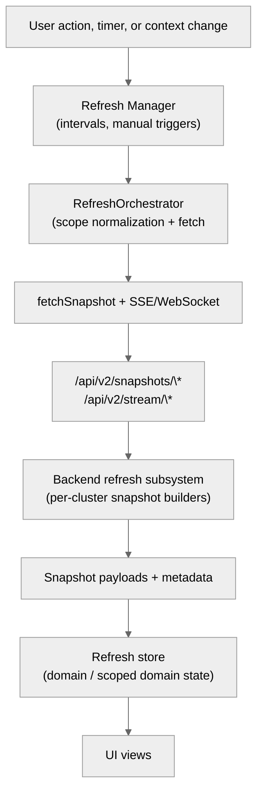

# Refresh system and multi-cluster support

This document explains how Luxury Yacht refreshes data, how refresh state flows through the frontend and backend, and how multi-cluster scoping is enforced. The goal is to make the mechanics easy to follow even if you are new to the codebase.

## Overview

The refresh system has three layers:

- Backend refresh subsystem(s) build snapshots and stream updates per cluster.
- A lightweight HTTP API serves snapshots, manual refresh jobs, and telemetry.
- The frontend refresh orchestrator schedules refreshes, scopes requests to the active cluster(s), and caches results in the refresh store.

Multi-cluster support uses a single refresh orchestrator in the frontend and a backend subsystem per active cluster. All snapshot payloads include cluster metadata, and frontend scopes encode cluster IDs so the right data shows in the right tab.

The refresh subsystem builds point-in-time "snapshots" for UI views and serves them over HTTP; streaming endpoints push incremental updates for long-lived views. The object catalog is the source of truth for namespaces/cluster listings. See backend/app_refresh_setup.go, backend/refresh/system/manager.go, backend/objectcatalog/service.go.

### Informers (watch + cache)

Informers are long-lived Kubernetes watchers that maintain an in-memory cache of resources. They continuously receive watch events from the API server and keep the cache current. Multiple consumers share the same informer instance, avoiding redundant API calls.

In this codebase, informers are used by:

- The **object catalog** to list resources efficiently instead of making direct API calls (backend/objectcatalog/informer_registry.go, backend/objectcatalog/collect.go).
- The **resource stream manager** to push real-time deltas to the frontend via WebSocket (backend/refresh/resourcestream/manager.go).
- The **event stream manager** to push Kubernetes Events via SSE (backend/refresh/eventstream/manager.go).
- The **response cache invalidation** layer to clear stale object detail/YAML caches when resources change (backend/response_cache_invalidation.go).
- Snapshot builders that read from informer listers instead of hitting the API directly.

The shared informer factory is created in backend/refresh/informer/factory.go, which wraps `k8s.io/client-go/informers.SharedInformerFactory` and gates informer creation on list+watch SSAR permission checks. A single factory instance is shared across all consumers within a cluster's refresh subsystem.

There is no direct frontend usage of informers; they are backend-only caches.

### Snapshots (point-in-time responses)

Snapshot builders gather data for specific "domains" (cluster, namespace, etc.) and assemble the JSON payloads the frontend requests. Each file under backend/refresh/snapshot/ implements a slice of that data (e.g., workloads, config, events). The refresh manager wires domains and permissions. See backend/refresh/snapshot/\*.go, backend/refresh/system/manager.go.

The frontend fetches snapshot payloads via fetchSnapshot in frontend/src/core/refresh/client.ts, used by the refresh orchestrator to load domains like nodes, namespace-workloads, etc. (frontend/src/core/refresh/orchestrator.ts). A direct UI example is the command palette doing a catalog search with fetchSnapshot('catalog', ...) in frontend/src/ui/command-palette/CommandPalette.tsx.

The backend snapshot service (backend/refresh/snapshot/service.go) wraps snapshot builders with a short-lived in-memory cache (`SnapshotCacheTTL = 5s`) and singleflight dedup to collapse concurrent requests for the same domain+scope into a single build.

### Streams (incremental updates)

Streams are long-lived connections that push updates to the frontend instead of requiring it to poll. There are two transport protocols:

**WebSocket** — used by the resource stream for most views (workloads, config, network, RBAC, storage, nodes, etc.). The frontend sends REQUEST/CANCEL messages; the backend responds with RESET, ADDED, MODIFIED, DELETED, COMPLETE, ERROR, and HEARTBEAT messages. A single shared WebSocket per cluster multiplexes all domain subscriptions. The resource stream hooks directly into shared informer event handlers, so updates arrive within milliseconds of a Kubernetes change.

**SSE (Server-Sent Events)** — used by the catalog stream (browse view), event stream, and container logs stream. These are unidirectional server-push connections with simpler reconnection semantics.

Stream endpoints:

- Catalog stream (SSE): backend/refresh/snapshot/catalog_stream.go → /api/v2/stream/catalog
- Event stream (SSE): backend/refresh/eventstream/handler.go → /api/v2/stream/events
- Container logs stream (SSE): backend/refresh/containerlogsstream/handler.go → /api/v2/stream/container-logs
- Resource stream (WebSocket): backend/refresh/resourcestream/handler.go → /api/v2/stream/resources

The frontend orchestrator starts/stops stream managers for live updates (frontend/src/core/refresh/orchestrator.ts):

- Catalog: frontend/src/core/refresh/streaming/catalogStreamManager.ts (EventSource)
- Events: frontend/src/core/refresh/streaming/eventStreamManager.ts (EventSource)
- Container logs: frontend/src/core/refresh/streaming/containerLogsStreamManager.ts (EventSource)
- Resources: frontend/src/core/refresh/streaming/resourceStreamManager.ts (WebSocket)

### How it ties together

- The object catalog periodically syncs: discovery → descriptors → RBAC evaluation → collection (via informers or direct list) → in-memory summaries. It exposes query APIs and a streaming channel for the catalog SSE endpoint.
  See backend/objectcatalog/discovery.go, backend/objectcatalog/sync.go, backend/objectcatalog/collect.go, backend/objectcatalog/query.go, backend/objectcatalog/streaming.go.
- Snapshot builders use live clients and cached data (including the catalog) to build responses on demand.
- The resource stream manager registers `AddEventHandler` callbacks on shared informers and broadcasts typed row deltas to WebSocket subscribers using the same `Build*Summary` helpers as the snapshot builders (backend/refresh/snapshot/streaming_helpers.go), ensuring both paths produce identical row shapes. See "Row builder single source of truth" below for the rule that enforces this and why it matters.

### Example - Cluster Overview

Frontend:

- Frontend triggers a snapshot refresh. ClusterOverview enables the domain and calls refreshOrchestrator.triggerManualRefresh('cluster-overview'), then reads data from useRefreshDomain('cluster-overview') (frontend/src/modules/cluster/components/ClusterOverview.tsx).
- The refresh orchestrator registers cluster-overview as a non-streaming domain and computes a cluster-scoped query string via scopeResolver (frontend/src/core/refresh/orchestrator.ts), so it uses snapshots only.
- fetchSnapshot builds a request to /api/v2/snapshots/cluster-overview with the scope (frontend/src/core/refresh/client.ts), and the returned payload is read from overviewDomain.data.overview and overviewDomain.data.metrics in the component (frontend/src/modules/cluster/components/ClusterOverview.tsx).

Backend:

- The refresh subsystem decides whether to use informers or a list fallback. If list/watch permissions exist for nodes/pods/namespaces, it registers the informer-based builder; otherwise it falls back to list-only (backend/refresh/system/manager.go).
- Informer path: RegisterClusterOverviewDomain wires the shared informer factory; the builder waits for cache sync and then lists from listers (nodes/pods/namespaces) to build the snapshot (backend/refresh/snapshot/cluster_overview.go).
- List fallback path: RegisterClusterOverviewDomainList fetches nodes/pods/namespaces directly from the API and builds the same snapshot (backend/refresh/snapshot/cluster_overview.go).
- The snapshot payload is assembled in buildClusterOverviewSnapshot (totals, CPU/memory, pod counts, version detection) and returned as the cluster-overview snapshot (backend/refresh/snapshot/cluster_overview.go).

### Example - Nodes

Frontend:

- Frontend enables the nodes domain when the Nodes tab is active in frontend/src/modules/cluster/contexts/ClusterResourcesContext.tsx, then reads data via useRefreshDomain('nodes'). The table in frontend/src/modules/cluster/components/ClusterViewNodes.tsx renders from that domain state.
- The refresh orchestrator registers nodes as a streaming domain and wires it to resourceStreamManager in frontend/src/core/refresh/orchestrator.ts. That manager opens a WebSocket to /api/v2/stream/resources and subscribes to the nodes domain.
- When the stream needs a baseline or resync, the frontend falls back to a snapshot fetch for nodes via fetchSnapshot inside resourceStreamManager (frontend/src/core/refresh/streaming/resourceStreamManager.ts).

Backend:

- If list/watch permissions are available, the nodes snapshot builder uses informer listers; otherwise it falls back to list-only. This is decided in backend/refresh/system/manager.go and implemented in backend/refresh/snapshot/nodes.go.
- The resource stream itself is fed by informers: backend/refresh/resourcestream/manager.go attaches event handlers to node/pod informers and broadcasts updates for the nodes domain to connected clients.
- So the Nodes view gets live updates from the resource stream, with the nodes snapshot as the fallback/baseline.

## Definitions

Explanations of terminology used in this document.

| Term                 | Area     | Definition                                                                                                                                                                                                                         |
| -------------------- | -------- | ---------------------------------------------------------------------------------------------------------------------------------------------------------------------------------------------------------------------------------- |
| Backend Subsystem    | Backend  | Backend refresh services that run for a cluster. Each active cluster has its own subsystem which registers domains, builds/serves snapshots, streams HTTP routes, runs manual refresh jobs, and records telemetry for its cluster. |
| Manual Refresh Job   | Backend  | A background task created when the frontend asks for an immediate refresh. It has a job ID and moves through states (queued, running, succeeded, failed, or cancelled) until it finishes.                                          |
| Refresh Domain       | Shared   | A data set related to one of the application's views (`cluster-overview`, `namespace-workloads`), diagnostics, object panel data, etc.                                                                                             |
| Scope                | Shared   | A string that tells the backend which slice of a domain to return, such as a namespace or a specific object. It is sent with snapshot and stream requests.                                                                         |
| Snapshot             | Shared   | A full response for a domain and scope at one moment in time. It includes metadata (version, timestamps, stats) and the data itself.                                                                                               |
| Snapshot Payload     | Shared   | The actual data inside a snapshot that the UI uses, without any snapshot metadata around it.                                                                                                                                       |
| Snapshot Stats       | Shared   | Extra info that describes how a snapshot was built, such as item counts, build time, and batch information.                                                                                                                        |
| Stream               | Shared   | A long-lived connection where the backend sends updates as they happen, rather than the frontend polling for new snapshots.                                                                                                        |
| Refresh              | Shared   | Getting the latest data for a domain and scope. This can be a one-time snapshot fetch or keeping a stream open for live updates.                                                                                                   |
| SSE                  | Shared   | Server-Sent Events: a standard HTTP stream where the server keeps the connection open and pushes text events to the client over time.                                                                                              |
| Telemetry            | Shared   | Timing and error tracking for refresh work. The backend records it, and the frontend diagnostics panel displays it.                                                                                                                |
| Cluster ID           | Shared   | The stable identifier used to keep data tied to a specific cluster. It is built as `filename:context` from the kubeconfig source and context name.                                                                                 |
| Cluster Name         | Shared   | The human-readable cluster name shown in the UI. It is the kubeconfig context name.                                                                                                                                                |
| Cluster Scope        | Shared   | A scope string that starts with a cluster ID or a list of cluster IDs, followed by a pipe char. This keeps data separated by cluster when multiple clusters are open.                                                              |
| Refresher            | Frontend | A timer configuration that says how often to refresh, how long to wait between refreshes, and how long a refresh can run before timing out.                                                                                        |
| Refresh Manager      | Frontend | The frontend controller that runs the refresher timers, listens for context changes, and triggers refresh callbacks. It does not fetch data itself.                                                                                |
| Refresh Orchestrator | Frontend | The frontend service that turns refresh callbacks into API calls. It builds scopes, fetches snapshots, stores results in the refresh store, and starts or stops streams.                                                           |
| Refresh Context      | Frontend | The current UI state used to decide what to refresh, including the active view, selected namespace, selected clusters, and object panel state.                                                                                     |
| Refresh Store        | Frontend | The frontend in-memory cache that holds snapshot data, status, and errors per domain and scope so UI components can read the latest refresh state.                                                                                 |
| Frontend Scope       | Frontend | The scope string the frontend builds. It includes the cluster ID(s) and any extra filters, and it is used both in network requests and as a key in the refresh store.                                                              |

### Refresh Manager vs Orchestrator

Manager is the scheduler, Orchestrator is the executor.

- Manager owns the timers and rules for when a refresh should happen (intervals, cooldowns, timeouts, manual triggers, context changes). It just fires callbacks.
- Orchestrator owns how a refresh happens. It builds scopes, calls snapshot APIs, starts/stops streams, writes results into the refresh store, and handles retry/error suppression.

So the Manager decides when to refresh. The Orchestrator decides what to fetch and where to store it.

### Refresh flow diagram

```mermaid
%%{ init: {
    "theme": "neutral",
    "themeVariables": { "wrap": "false" },
    "flowchart": { "wrappingWidth": "600" }
}}%%
flowchart TD
    A["`User action, timer, or context change`"]
    --> B["Refresh Manager
          (intervals, manual triggers)"]
    --> C["RefreshOrchestrator
          (scope normalization + fetch"]
    --> D["fetchSnapshot + SSE/WebSocket"]
    --> E["/api/v2/snapshots/\*
          /api/v2/stream/\*"]
    --> F["Backend refresh subsystem
          (per-cluster snapshot builders)"]
    --> G["Snapshot payloads + metadata"]
    --> H["Refresh store
          (domain / scoped domain state)"]
    --> I["UI views"]
```

## Key concepts

### Domains

A refresh domain is a logical data set (for example `cluster-config`, `namespace-workloads`, or `object-details`). Domain names are defined in:

- `frontend/src/core/refresh/types.ts`
- `frontend/src/core/refresh/refresherTypes.ts`

Domains are registered in `frontend/src/core/refresh/orchestrator.ts` with:

- A refresher name (used by the refresh manager).
- A category (`system`, `cluster`, or `namespace`).
- Optional `autoStart` flag (default is `false` — see Refreshers section).
- Optional streaming registration (SSE or WebSocket).

On the backend, domains are registered in `backend/refresh/system/manager.go` and implemented in `backend/refresh/snapshot/*.go`.

### Refreshers

Refreshers are timers that fire refresh callbacks. The refresher names and their interval/cooldown/timeout config live in:

- `frontend/src/core/refresh/refresherTypes.ts`
- `frontend/src/core/refresh/refresherConfig.ts`

The refresh manager (`frontend/src/core/refresh/RefreshManager.ts`) manages the timers, cooldowns, timeouts, and manual refresh triggers.

**`autoStart` and `DEFAULT_AUTO_START`**: When a domain is registered, the orchestrator creates a refresher and optionally starts it. `DEFAULT_AUTO_START` is `false`, so refreshers are **disabled by default** unless the domain sets `autoStart: true`. Most domains rely on view hooks or `ClusterResourcesContext` to explicitly enable their scopes and trigger fetches, rather than auto-starting a polling timer.

**`pauseRefresherWhenStreaming`**: Streaming domains set this flag on their `StreamingRegistration`. It means "create a refresher (polling timer) for this domain, but the orchestrator may skip snapshot fetches when streaming is healthy." The refresher serves as a fallback — if the stream disconnects or becomes unhealthy, snapshot polling resumes automatically. In practice, `isStreamingHealthy` only returns true for resource-stream domains (WebSocket), so SSE-based streaming domains (catalog, events) always fall through to snapshot fetches on each tick.

### Scopes

A scope describes which slice of a domain to fetch. Scopes are always cluster-aware in multi-cluster mode:

- Single cluster scope: `clusterId|<scope>`
- Multi-cluster scope: `clusters=id1,id2|<scope>`
- If `<scope>` is empty, the delimiter is still present: `clusterId|`

Helpers live in `frontend/src/core/refresh/clusterScope.ts`:

- `buildClusterScope(clusterId, scope)`
- `buildClusterScopeList(clusterIds, scope)`

For namespace scopes, the orchestrator prepends `namespace:` and then applies the cluster prefix. See `normalizeNamespaceScope` in
`frontend/src/core/refresh/orchestrator.ts`.

### Snapshots and store state

Snapshots are the backend response payloads served by `/api/v2/snapshots/{domain}`. The frontend stores them in `frontend/src/core/refresh/store.ts`. Each domain has state like:

- `status`: `idle`, `loading`, `initialising`, `updating`, `ready`, `error`
- `data`: latest payload (or `null`)
- `stats`: server-side stats (counts, durations, batch info)
- `error`: last error message if any
- `etag`: checksum for 304 handling

Unscoped domains store their data in `domains`, and scoped domains store data in `scopedDomains` keyed by the full scope string (including the cluster prefix).

### Manual vs auto refresh

- Auto refresh: driven by the refresher timers.
- Manual refresh: explicitly triggered when context changes (view switch, cluster
  tab switch, object panel open, etc) or when the user clicks refresh.

The refresh manager decides which refreshers to trigger based on the refresh context (`RefreshContext` in `RefreshManager.ts`).

### Streaming

Streaming domains use long-lived connections instead of polling. There are three streaming subsystems:

**Resource stream (WebSocket)** — the primary streaming mechanism for most views. Covers: namespace-workloads, namespace-config, namespace-network, namespace-rbac, namespace-storage, namespace-autoscaling, namespace-quotas, namespace-custom, namespace-helm, cluster-rbac, cluster-storage, cluster-config, cluster-crds, cluster-custom, nodes, and pods. Uses `resourceStreamManager` on the frontend and `resourcestream.Manager` on the backend. Streams are **view-gated**: they only start when the corresponding view is active (`isResourceStreamViewActive`), and are torn down when the user navigates away.

**Event stream (SSE)** — pushes Kubernetes Events. `cluster-events` and `namespace-events` use `eventStreamManager`. Each scope maintains an in-memory sorted list of up to 500 events with merge-by-UID deduplication. Supports resume via sequence tokens on reconnect.

**Container logs stream (SSE)** — pushes container logs for the Object Panel Logs Tab. Uses `containerLogsStreamManager`. Has a polling fallback (`containerLogsFallbackManager`) used by the log viewer when streaming is unavailable or disabled.

**Catalog stream (SSE)** — pushes browse view catalog snapshots. Uses `catalogStreamManager`. The catalog SSE delivers full snapshots (not deltas). `snapshotMode: full|partial` reflects backend batching of a snapshot payload, not a user-visible pagination model.

Streaming is wired in `frontend/src/core/refresh/orchestrator.ts` and uses `/api/v2/stream/*` endpoints on the backend.

#### fetchScopedDomain behavior for streaming domains

When `fetchScopedDomain` is called for a domain with streaming configured:

- **Manual fetch (`isManual: true`)**: if the stream is already active (`isStreamingActive` returns true), the fetch is redirected to `refreshStreamingDomainOnce` instead of performing a snapshot HTTP fetch. This means the SSE/WebSocket stream handles the data delivery, not the snapshot endpoint.
- **Auto refresh (`isManual: false`)**: the orchestrator calls `startStreamingScope` (fire-and-forget to ensure streaming is running), then checks `isStreamingHealthy`. If healthy (only true for resource-stream WebSocket domains), the snapshot fetch is skipped. Otherwise, it falls through to a normal `performFetch`.

#### Resource streaming invariants and fallbacks

The resource stream (pods, namespace workloads, nodes) uses a WebSocket transport with explicit resync triggers. These rules are enforced so the UI can fall back to snapshots safely:

- Each domain/scope stream must deliver monotonic `resourceVersion` values. If a message is missing a version or the version moves backwards, the frontend triggers a snapshot resync and ignores the stream until resynced.
- Backend sends `RESET` at subscription start and `COMPLETE` when a subscriber is dropped or a resync is required. The frontend treats both as resync signals.
- Backpressure is enforced per domain/scope. If a subscriber falls behind, the backend drops it and emits a `COMPLETE` with an error string so the client resyncs.
- The frontend coalesces bursts of updates over a short window; while a resync is in flight, update messages are ignored.
- Drift detection: the frontend samples consecutive updates and compares against snapshot data. Significant divergence triggers a `refresh:resource-stream-drift` event, temporarily blocking streaming and falling back to polling.

These rules are implemented in:

- Backend: `backend/refresh/resourcestream/handler.go` and `backend/refresh/resourcestream/manager.go`.
- Frontend: `frontend/src/core/refresh/streaming/resourceStreamManager.ts`.

## Frontend architecture

### RefreshManager

`frontend/src/core/refresh/RefreshManager.ts` is responsible for:

- Registering refreshers (interval, cooldown, timeout).
- Starting/stopping refresh loops.
- Triggering manual refreshes based on context changes.
- Cancelling in-flight refreshes on `kubeconfig:changing`.
- Emitting `refresh:state-change` events for UI consumers.

It does not fetch data directly. Instead it invokes callbacks registered by the refresh orchestrator.

### RefreshOrchestrator

`frontend/src/core/refresh/orchestrator.ts` coordinates domains. It:

- Registers domains and their refreshers.
- Normalizes scopes using the active cluster selection.
- Fetches snapshots via `fetchSnapshot` in `client.ts`.
- Stores results in the refresh store (`store.ts`).
- Starts/stops streaming managers.
- Suppresses transient network errors when the backend rebuilds refresh services.
- Cancels in-flight refreshes when the refresh context version changes.

Key behaviors to know:

- Unscoped domains still receive a cluster scope (so tab switches on the same view re-fetch the correct cluster data).
- Scoped domains require a valid scope; otherwise an error is raised.
- When `kubeconfig:changing` fires, the orchestrator cancels in-flight work, clears state, disables domains, and stops streams.
- When `kubeconfig:selection-changed` or `kubeconfig:changed` fires, the orchestrator invalidates the refresh base URL and suppresses transient network errors while the backend rebuilds.

### Refresh store and hooks

The store (`frontend/src/core/refresh/store.ts`) is accessed with hooks such as:

- `useRefreshDomain` and `useRefreshScopedDomain`
- `useRefreshScopedDomainStates`
- `useRefreshScopedDomainEntries`
- `useRefreshState`

Other refresh utilities live in `frontend/src/core/refresh/hooks`, including `useRefreshContext`, `useRefreshManager`, and `useRefreshWatcher`.

### Refresh context

The refresh context is updated whenever:

- The active view changes.
- The active namespace changes.
- The active cluster tab changes.
- The object panel opens/closes.

The orchestrator updates its context via `refreshOrchestrator.updateContext(...)` and the refresh manager mirrors it to decide which refreshers to fire.

### Background refresh toggle

The "Refresh background clusters" setting is handled by `frontend/src/core/refresh/hooks/useBackgroundRefresh.ts`:

- Stored in localStorage key `refreshBackgroundClustersEnabled`.
- Default is enabled (true).
- Emits `settings:refresh-background` on changes.

`KubeconfigContext` uses this flag to populate `selectedClusterIds`:

- Enabled: `selectedClusterIds` includes all active clusters.
- Disabled: `selectedClusterIds` includes only the active tab cluster.

### Diagnostics

The diagnostics UI uses:

- `RefreshDiagnosticsPanel` in `frontend/src/core/refresh/components`.
- `fetchTelemetrySummary` in `frontend/src/core/refresh/client.ts`.
- `telemetry/recorder.go` on the backend.

The panel surfaces per-domain timings, errors, and permission issues.

## Backend architecture

### Refresh subsystem per cluster

The backend builds one refresh subsystem per active cluster (`backend/app_refresh_setup.go`). Each subsystem includes:

- A shared informer factory (`backend/refresh/informer/factory.go`) with RBAC-gated informer creation.
- A domain registry (`backend/refresh/domain`).
- Snapshot builders (`backend/refresh/snapshot/*.go`).
- A snapshot service with short-lived caching and singleflight dedup (`backend/refresh/snapshot/service.go`).
- A manual refresh queue (`backend/refresh/types.go`).
- Streaming managers: resource stream (`backend/refresh/resourcestream`), event stream (`backend/refresh/eventstream`), container logs stream (`backend/refresh/containerlogsstream`).
- A telemetry recorder (`backend/refresh/telemetry`).

### Row builder single source of truth

Every row type that appears in a snapshot payload (`PodSummary`, `ConfigSummary`, `NetworkSummary`, `ClusterCRDEntry`, `AutoscalingSummary`, `ClusterCustomSummary`, `NamespaceCustomSummary`, …) has **exactly one constructor** — a `Build*Summary` helper in `backend/refresh/snapshot/streaming_helpers.go`. The full-snapshot builders in `backend/refresh/snapshot/*.go` call the same helper rather than inlining their own `TypeName{...}` struct literal. This is deliberate and load-bearing.

**The rule:** any new field added to a row type MUST be populated by the `Build*Summary` helper. Never construct the row inline in a snapshot builder.

**Why:** the snapshot builder and the streaming update path are two independent entry points that both produce rows of the same type. If they construct the row independently (two literals in two files), a new field added to the type will only be populated by whichever one the author remembers to update. The other path will emit rows with the field at its zero value, and every row that happens to be rebuilt via that path (e.g. after an informer event) will lose the field. This is how the "CRD version column disappears after a refresh" and "HPA scale target apiVersion silently drops on every status update" bug classes get introduced — the snapshot emits the right data at first paint, then streaming updates overwrite each row with a partial version.

The convergence pattern (snapshot builder delegates to streaming helper) makes the bug class structurally impossible. There's only one place to forget.

**Regression guards:** each helper with a critical threaded field has a matching `TestBuild*SummaryPopulatesAllFields` test in `backend/refresh/snapshot/streaming_helpers_test.go` that asserts the field is populated. These tests carry a doc comment calling out the "any new field added to this struct MUST be asserted here" rule — the test is as much a place to add a new assertion as it is a verifier of existing behavior.

**Exceptions:** none. `PodSummary` has an internal `buildPodSummary` helper that `BuildPodSummary` delegates to, which is fine — it's still a single path. `WorkloadSummary` is built by `NamespaceWorkloadsBuilder`'s internal methods, which the streaming helper also uses. `NodeSummary` goes through `BuildNodeSnapshot`. All of these are single-source-of-truth even if the helper isn't literally in `streaming_helpers.go`.

### Response cache

The response cache (`backend/response_cache.go`) is a separate in-memory cache for object detail panel data: object details, YAML content, and Helm manifest/values. It has a configurable TTL (`ResponseCacheTTL = 10s`) and a max-entries cap.

Cache invalidation (`backend/response_cache_invalidation.go`) registers `AddEventHandler` callbacks on every shared informer. When a resource changes, the corresponding object detail and YAML cache entries are cleared. Pods are excluded from invalidation to avoid high-churn cache thrashing. A warm-up guard skips ADD events for old objects during the informer's initial list phase to prevent the cache from being thrashed at startup.

### Snapshot API

The HTTP API is served from `backend/refresh/api/server.go`:

- `GET /api/v2/snapshots/{domain}?scope=...`
- `POST /api/v2/refresh/{domain}` for manual refresh jobs
- `GET /api/v2/jobs/{id}` for job status
- `GET /api/v2/telemetry/summary`

### Multi-cluster aggregation

When multiple clusters are active, the backend wraps per-cluster subsystems with aggregate services (see `backend/app_refresh_setup.go`):

- Aggregate snapshot service merges cluster-scoped responses.
- Aggregate manual queue targets the correct cluster(s).
- Aggregate event, log, resource, and catalog stream handlers fan-in per-cluster streams.

### Object catalog

The object catalog is the source of truth for cluster and namespace listings. It runs a periodic sync loop (`backend/objectcatalog/sync.go`) that discovers API resources, evaluates RBAC permissions, and collects object summaries from informer caches or direct list calls. The sync interval defaults to 1 minute (`defaultResyncInterval`).

The catalog exposes:

- `Query()` for paginated, filtered access to the in-memory catalog (used by both the snapshot endpoint and the SSE stream handler).
- `SubscribeStreaming()` for SSE subscribers to receive notifications when the catalog changes.
- `Namespaces()`, `Descriptors()`, `Health()` for metadata access.

Catalog snapshots are surfaced in the `catalog` refresh domain (see `backend/refresh/snapshot/catalog.go`). The catalog SSE stream handler (`backend/refresh/snapshot/catalog_stream.go`) subscribes via `SubscribeStreaming()`, re-queries on each signal, and pushes full snapshots to connected clients.

### Permission gating

The backend primes permissions up front and skips domains that the user cannot list. Missing permissions are recorded as `PermissionIssue` entries and exposed through diagnostics. See `backend/refresh/system/manager.go` and `backend/refresh/snapshot/permission.go`.

## Multi-cluster behavior

### Cluster identity

- `clusterId`: `filename:context` (stable key)
- `clusterName`: `context` (display)

All refresh scopes, snapshot payloads, and object-panel actions use `clusterId` to keep data aligned with the active tab.

### Active tab vs background refresh

The refresh context has two cluster fields:

- `selectedClusterId`: the active tab cluster.
- `selectedClusterIds`: the cluster list to refresh in the background.

When background refresh is disabled, `selectedClusterIds` contains only the active tab. When enabled, it contains all open tabs.

The refresh manager uses `selectedClusterIds` to avoid forcing a manual refresh on tab switches when background refresh already covers multiple clusters.

### Scope normalization rules

`normalizeScope` in the orchestrator applies these rules:

- If a scope is already cluster-prefixed, keep it.
- If the scope is empty, attach the active cluster list and keep a trailing `|`.
- Otherwise, prefix the scope with the selected cluster list.

This ensures all requests are cluster-scoped, even for "unscoped" domains.

### Cluster events and namespace events

- `cluster-events` streams over the selected cluster list.
- `namespace-events` scopes to the selected namespace and its cluster.

### Special scope resolvers

- `cluster-overview` scopes to the active tab cluster only (to avoid closed-tab errors).
- `catalog` uses an explicit scope override (defaults to `limit=200`) and is still cluster-prefixed by the orchestrator.

### No clusters active

When the selection becomes empty (`kubeconfig:changing`):

- Refreshers are disabled and in-flight requests are cancelled.
- Streaming connections are stopped.
- Snapshot state is cleared.

When at least one cluster becomes active (`kubeconfig:changed`), the refresh base URL is re-resolved and refresh resumes through normal context updates.

### Refresh base URL rebuilds

The refresh HTTP server is rebuilt when the backend refresh subsystem is torn down and recreated. The frontend handles this by:

- Invalidating the cached refresh base URL.
- Retrying snapshot fetches with backoff.
- Suppressing transient network errors during the rebuild window.

See `frontend/src/core/refresh/client.ts` and `orchestrator.ts`.

## Common flows

### App startup

1. `KubeconfigContext` loads saved selections via `GetSelectedKubeconfigs`.
2. The refresh context is updated with selected cluster IDs.
3. The refresh orchestrator begins fetching the active view domains.

### Opening or switching cluster tabs

1. The active tab updates `selectedClusterId`.
2. The refresh context updates, triggering manual refresh targets.
3. If background refresh is disabled, the active view is refreshed immediately.

### Closing a cluster tab

1. The selection list is updated and `selectedClusterIds` shrink.
2. Scopes tied to the closed tab are no longer enabled, so they stop refreshing.
3. Streams and in-flight requests for those scopes are cancelled.

### Object panel open

1. The object panel updates the refresh context with object metadata.
2. `object-details` and `object-events` refreshers are triggered.
3. Logs use `container-logs` streaming (with fallback polling if needed).

### Catalog browse

The `catalog` domain uses SSE streaming via `catalogStreamManager`. On mount, `useBrowseCatalog` enables the catalog scope and triggers an initial manual fetch. The catalog SSE stream delivers full snapshots as the backend catalog updates. The browse view reconciles those incoming snapshots against the current local item list so additions, deletions, and updates are reflected immediately while unchanged items keep stable references.

The `ClusterResourcesContext` explicitly excludes the catalog domain from its lifecycle management — the browse view manages its own domain enable/disable via `useBrowseCatalog`.

## Adding or updating refresh domains

When adding a new domain, update:

1. `frontend/src/core/refresh/types.ts` and `DomainPayloadMap`.
2. `frontend/src/core/refresh/refresherTypes.ts` and `refresherConfig.ts`.
3. `frontend/src/core/refresh/orchestrator.ts` (register domain, scopes, streaming).
4. `frontend/src/core/refresh/components/diagnostics/diagnosticsPanelConfig.ts`.
5. Backend snapshot builders in `backend/refresh/snapshot`.
6. Backend domain registration in `backend/refresh/system/registrations.go`.
7. **Extract row construction into a `Build*Summary` helper** in `backend/refresh/snapshot/streaming_helpers.go`. The snapshot builder from step 5 calls this helper; don't inline the struct literal. Add a regression test alongside the existing `TestBuild*SummaryPopulatesAllFields` tests in `streaming_helpers_test.go`. See "Row builder single source of truth" above for the why.

If adding a streaming domain:

8. Register the stream handler in `backend/refresh/system/streams.go`.
9. For resource-stream domains, add informer event handlers in `backend/refresh/resourcestream/manager.go`. Use the same `Build*Summary` helper as the snapshot path — that's what makes the dual-path drift bug class impossible.
10. For SSE domains, implement a stream handler similar to `catalog_stream.go` or `eventstream/handler.go`.

When adding a new **field** to an existing row type:

- Add it to the Go struct in `backend/refresh/snapshot/*.go`.
- Populate it in the `Build*Summary` helper in `streaming_helpers.go` (not in the snapshot builder's inline construction — that path should delegate to the helper).
- Extend the matching `TestBuild*SummaryPopulatesAllFields` test to assert the new field.
- Add the field to the matching frontend TypeScript interface in `frontend/src/core/refresh/types.ts`.
- Thread it through any frontend mapping in the resources contexts (e.g. `NsResourcesContext`, `ClusterResourcesContext`).

Always include cluster metadata in snapshot payloads and ensure scopes are cluster-prefixed for multi-cluster safety.
