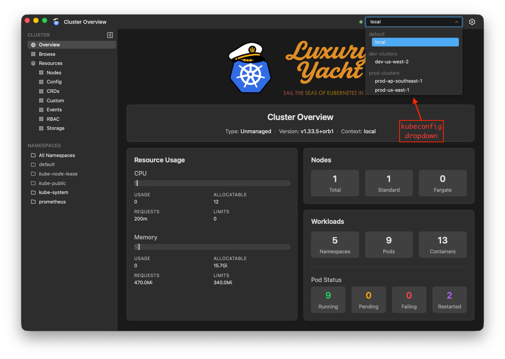
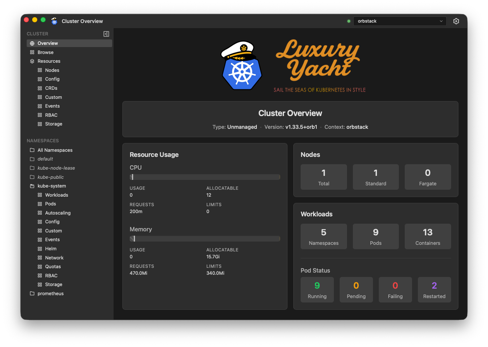
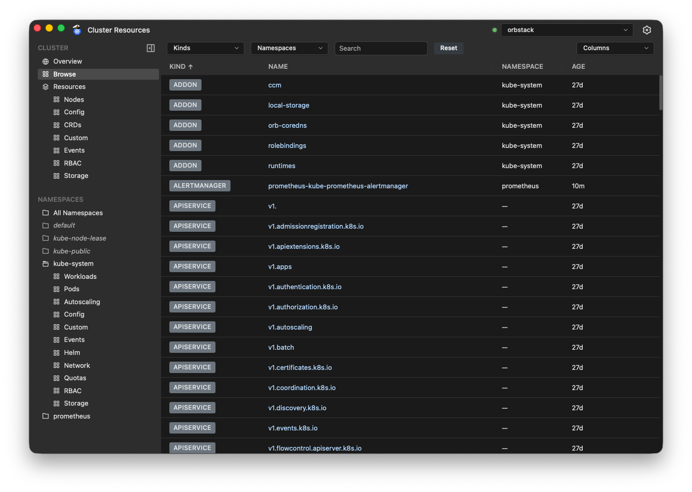
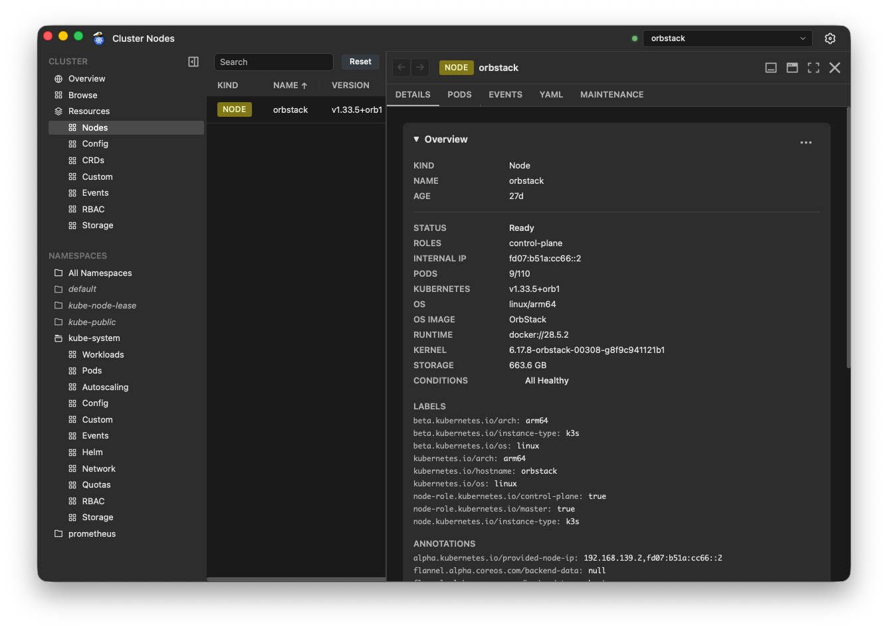
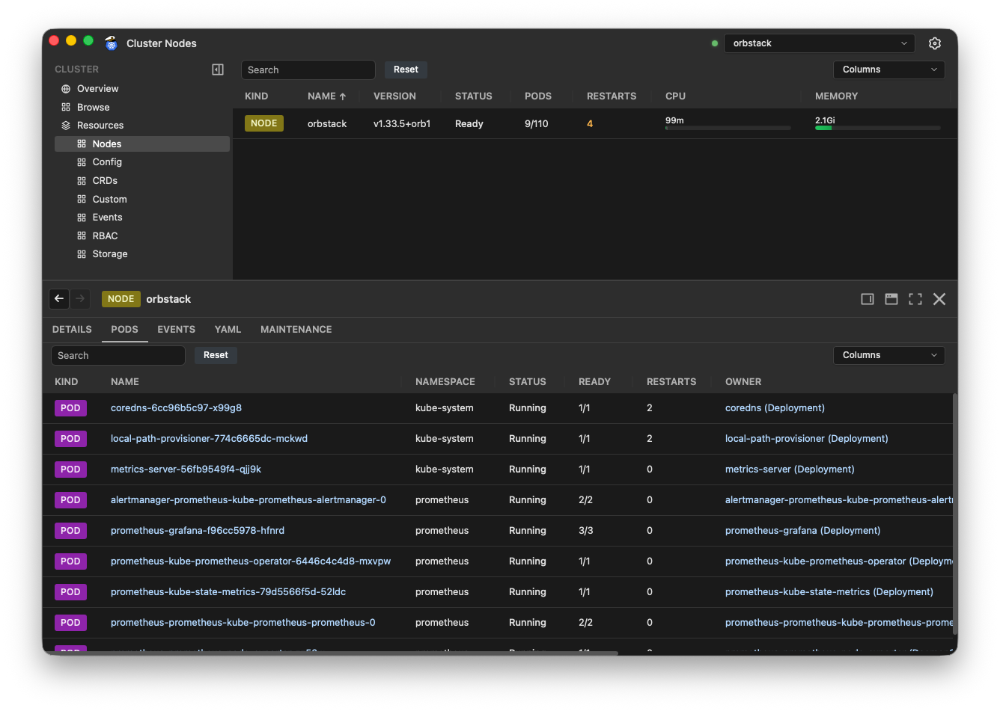
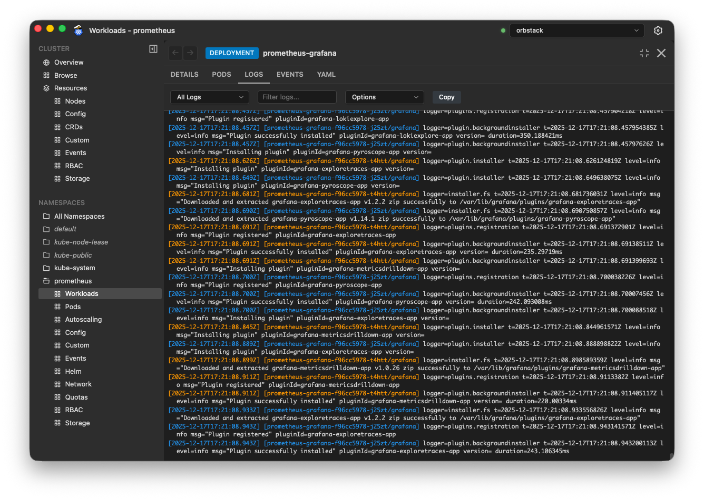
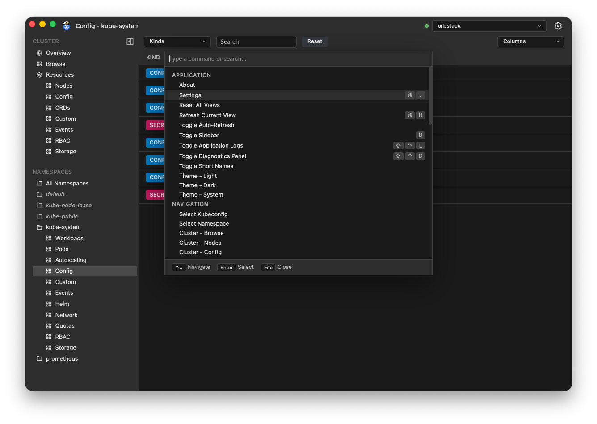
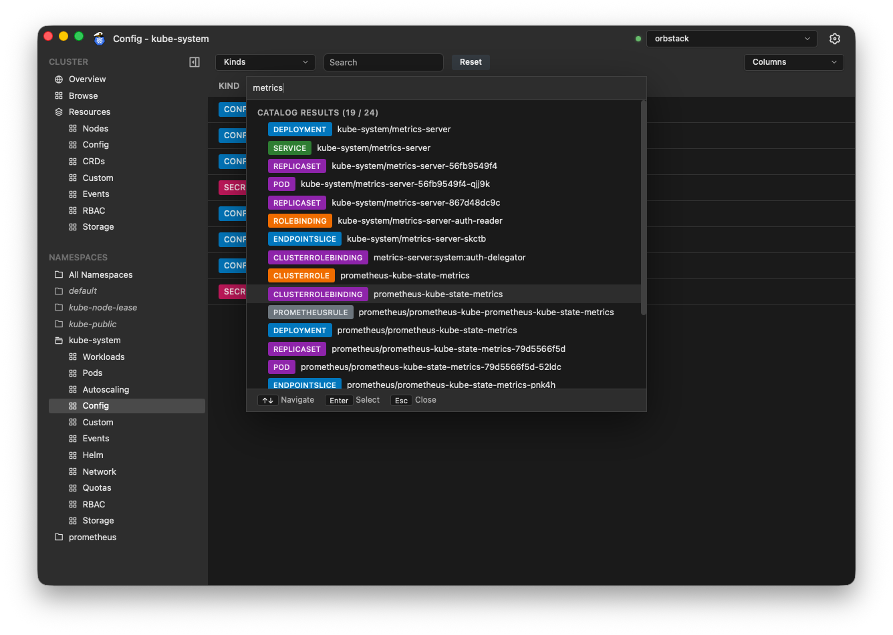

# How To Use Luxury Yacht

Welcome aboard Luxury Yacht! This doc explains the features of the app.

## Authentication

Luxury Yacht reads your `.kube` directory and loads your existing kubeconfig files. It does not create kubeconfig files, nor will it ever modify them in any way. It's up to you to get those working correctly for your clusters.

It will display any kubeconfigs it finds in the kubeconfig dropdown in the top right of the window.

The kubeconfig dropdown shows the filenames the app discovered, and the Kubernetes contexts within each file. Click the context you want to use to activate it.

## Cluster Overview

The Cluster Overview is the view you'll land on when first starting the app, or switching kubeconfigs. It shows you general information about the cluster at a high level.

## Table Views

With the exception of the Cluster Overview, all of the other views you can select are tables.

All table views support column sorting by clicking on the column header. Columns that display resource utilization bars are not sortable. An arrow will appear next to the column name to show the sort direction.

You can hide/show columns by using the **Columns** dropdown at the top right of the table. Kind and Name columns must remain visibile and may not be hidden.

Use the **Kinds** and **Namespaces** dropdowns as well as the free text search box to filter the data displayed in the view. Click the **Reset** button to clear all filters.

All tables support context-aware right-click menus. In some cases, these context menus may contain actions for the selected object, such as delete, workload restarts and scaling, etc.

## Sidebar

From the Sidebar, you can choose a view of the cluster's resources. The Sidebar is organized into cluster-scoped resources and namespaced resources.

### Cluster-Scoped Resources

- **Overview** shows the Cluster Overview.
- **Browse** shows all objects in the cluster. Use **Load More** to fetch additional pages.

Within the **Resources** section:

- **Nodes** shows all cluster Nodes.
- **Config** shows cluster-scoped config resources, such as StorageClasses and IngressClasses.
- **CRDs** shows all Custom Resource Definitions.
- **Custom** shows cluster-scoped custom resources that were created from CRDs.
- **Events** shows all events, including namespaced events.
- **RBAC** shows cluster-scoped RBAC resources, such as ClusterRoles and ClusterRoleBindings.
- **Storage** shows cluster-scoped storage resources, such as PersistentVolumes.

### Namespaced Resources

Select a namespace to view resources in that namespace.

- **Workloads** shows Deployments, StatefulSets, DaemonSets, and Cronjobs.
- **Pods** shows pods.
- **Autoscaling** shows autoscaling resources, such as HorizontalPodAutoscalers.
- **Config** shows namespaced config resources, such as ConfigMaps and Secrets.
- **Custom** shows namespaced resources created from CRDs.
- **Events** shows events in the selected namespace.
- **Helm** shows Helm chart releases.
- **Network** shows network resources, such as Services and Ingresses.
- **Quotas** shows quota-related resources, such as PodDisruptionBudgets.
- **RBAC** shows namespaced RBAC resources, such as Roles and RoleBindings.
- **Storage** shows namespaced storage resources, such as PersistentVolumeClaims.

There is a special **All Namespaces** view which shows resources in any namespace. For example, selecting the **Pods** view under **All Namespaces** will show you all pods in the cluster.

### Sidebar Visibility

You can toggle the Sidebar's visibility by clicking the collapse/expand icon or pressing `ctrl+B` (Linux/Windows) or `cmd+B` (macOS).

## Object Panel

Clicking on the Kind Badge or Name of an object will open the Object Panel, to display details about the selected object.

The tabs and information displayed in the Object Panel will depend on the currently selected object Kind.

| Tab Name    | Visibility       | Description                                                                                                                                                                                       |
| ----------- | ---------------- | ------------------------------------------------------------------------------------------------------------------------------------------------------------------------------------------------- |
| Details     | All views        | Shows details about the selected object. The information displayed will depend on the object Kind.                                                                                                |
| Events      | All views        | Shows events related to the selected object.                                                                                                                                                      |
| YAML        | All views        | Shows the selected object's YAML. If you have sufficient permissions, you will see an Edit button that allows you to edit the live configuration.                                                 |
| Pods        | Nodes, Workloads | Shows pods associated with the selected object.                                                                                                                                                   |
| Logs        | Workloads, Pods  | Shows logs for the pod(s) associated with the object. See the Log Viewer section for more info.                                                                                                   |
| Shell       | Pods             | Open a shell in a specific container. This tab will only be visible if you have the necessary `pods/exec` permissions.                                                                            |
| Maintenance | Nodes            | Cordon/Uncordon, drain, and delete nodes.                                                                                                                                                         |
| Manifest    | HelmReleases     | Shows the complete Kubernetes manifest generated by the Helm chart.                                                                                                                               |
| Values      | HelmReleases     | Shows the values used by the Helm chart. **- Defaults** shows the default chart values. **- Overrides** shows values that were manually overridden. **- Merged** shows all chart values. |

### Dock/Float/Maximize

The Object Panel can be docked to the right or bottom of the app, float over the app, or be maximized to use all available space. Use the window control buttons to change the Object Panel's state.

#### Docked to the Right

#### Docked to the Bottom

#### Floating

Note that when the Object Panel is open, it will cover up some part of the table view area.

### Log Viewer

Luxury Yacht has a sophisticated log viewer.

When a Workload is selected, it will show aggregated logs from all pods that belong to that workload. Pods are color-coded to easily distinguish multiple pods in the combined logs.

Use the Pod/Container selection dropdown and Filter text box to filter the logs.

#### Options

The Options dropdown gives you some control over how the logs are displayed.

| Option              | Hotkey | Description                                                                                                                                                                                                                       |
| ------------------- | ------ | --------------------------------------------------------------------------------------------------------------------------------------------------------------------------------------------------------------------------------- |
| Auto-scroll         | `S`    | Automatically scroll when new logs are received.                                                                                                                                                                                  |
| Auto-refresh        | `R`    | Automatically refresh logs. When disabled, a manual Refresh button will be displayed.                                                                                                                                             |
| Show API timestamps | `T`    | Show the timestamps added to logs by the Kubernetes API. Useful when the logs don't have timestamps, or the timestamps aren't human-readable.                                                                                     |
| Wrap text           | `W`    | Enable/disable line wrapping.                                                                                                                                                                                                     |
| Show previous logs  | `X`    | Shows the previous logs from a crashed container. This option is only available when viewing logs for a Pod, not available for workloads.                                                                                         |
| Parse as JSON       | `P`    | Parses JSON logs into a table format. This option is only available when the logs are valid JSON.  Note that logs that are not able to be parsed will not be visible, so if logs appear to be missing, disable this option. |

#### Copy Logs to the Clipboard

Click the **Copy** button to copy everything in the logs buffer to the clipboard. This will copy logs in their native format, so if you are using the parsed JSON view, the Copy button will copy the logs as JSON, not the table format.

## Command Palette

Luxury Yacht has a Command Palette that can be invoked with `shift+ctrl+P` (Linux/Windows) or `shift+cmd+P` (macOS).

The Command Palette can be used to control application features, navigate the app, and search for kubernetes objects.

Some examples of what you can do with the Command Palette:

- Open application windows/panels (Settings, Logs, Diagnostics)
- Change the app theme (light/dark/system) or other settings
- Switch to a different kubeconfig
- Open a table view
- Select a Namespace
- Open the Object Panel for a kubernetes object

To keep the list size reasonable, the Command Palette does not show all possible selections in the list. For example, Kubernetes objects are not displayed, but they will appear if you search for them.

The Command Palette's search supports simple fuzzy searches. For example, searching for `pod kube-sys metrics` will show `metrics-server` pods in the `kube-system` namespace.

## Developer Features

Luxury Yacht ships with some features to assist with app development.

### Application Logs

Press `shift+ctrl+L` to open the Application Logs viewer. This is a searchable, filterable view of application logs to provide some insight into what's happening behind the scenes as the app runs.

### Diagnostics Panel

Press `shift+ctrl+D` to open the Diagnostics Panel. Luxury Yacht has a complex backend that retrieves and refreshes data, and checks user permissions in the cluster to determine what features of the app are available. The Diagnostics Panel shows the status of the active refresh domains and permissions checks, so can be useful to understand what's happening in that system.
